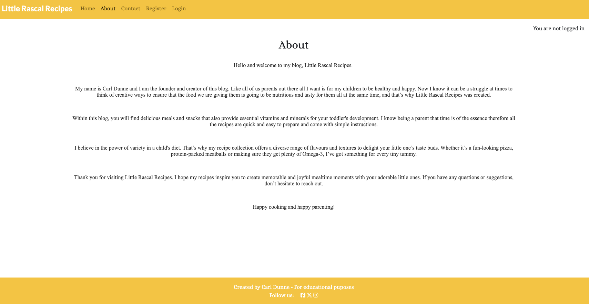

# Little Rascal Recipes Blog

## Live website

Link to live website: [Little Rascal Recipes](https://little-rascal-recipes-7007a778b4a8.herokuapp.com/)

## Purpose of the project

This is my project 4 for Code Institute as part of their Full stack development diploma. The project is a Full Stack website built using the Django framework.

Little Rascal Recipes is a blog where users can look for a delicious and nutritious meal or snack to prepare for their children aged 12 months and over.

This website initially provides the user with a homepage enticing them to ‘Explore popular Recipes’. Once clicked the page drops down showcasing popular recipes for their child, this is where the user will be prompted to sign up. Once a user signs up and logs in they will have access to a share page where they can view shared and share thier own cookbooks for kids, and have the opportunity to access and partake in the comments section on each recipe. 

## Table of contents

- [1. User Expeience](#user-experience-ux)
- [2. Agile Methodology](#agile-methodology)
- [3. The Scope](#the-scope)
- [4. Design](#design)
- [5. Features](#features)
- [6. Django Admin](#django-admin)
- [7. Technologies Used](#technologies-used)
- [8. Testing](#testing)
- [9. Deployment](#deployment)
- [10. Credits](#credits)
- [11. Acknowledgements](#acknowledgements)

## User Experience (UX)

### User Stories

* As a website user, I can:

1. Navigate around the site and easily view the content.

2. View a few selected recipes and choose accordingly.

3. Click on post to read the recipe details.

4. See the about page which provides information on the bolgs creator.

5. Register for an account to access the services offered to members.

* As logged in website user, I can:

1. Comment on recipes and give my opinion.

2. Delete any of my previous comments.

3. Logout from the website.

* As a website superuser, I can:

1. Create and publish a new recipe.

2. Create draft recipe posts that can be reviewed and finalised/ published later.

3. Create a new user.

4. Delete user.

5. Approve, reject or delete user's comments.

### MoSCoW

This project used the "MoSCoW" method to classify its features and requirements according to their importance towards a minimum viable product (MVP). "MoSCoW" stands for "Must have, Should have, Could have and Won't have," with each classification aiding in the prioritisation of features. This method makes sure that essential components are tackled in priority order.

## Agile Methodology

* All functionality and development of this project were managed using GitHub Projects. This can be found here [Github Projects](https://github.com/users/DeveloperDunne/projects/4)

## The Scope

### Main Site Goals

* To provide users with a good experience when using the website.
* To provide users with a visually pleasing website that is intuitive to use and easy to navigate.
* To provide a website with a clear purpose.
* To provide role-based permissions that allows users to interact with the website.
* The ability to find relevant information on the business and its services.
* The ability to update and delete comments if desired.
* The ability to interact with content by commenting.

### Target audience

This blog is for users that are interested in healthy and delicious food for their children.

## Design

### Wireframes
Balsamiq was used to design the blogs look.

### Colour Theme

### Fonts
Fonts used were 'Lato', 'Raleway' and 'Alice'. All were sourced from [Google Fonts](https://fonts.google.com/).

## Features

### Navigation Bar

#### Not logged in:

#### Logged in:

#### Logged in message:

### Home Page

#### Home Page - Popular Recipes

### Recipe Details

#### Recipe Details - Comments Logged in:

#### Recipe - Comments logged out:

### About Page

### Contact Page

### Register Page

### Sign In Page

### Sign Out Page

### Sign Out Confirmation

### Share Page

#### Share Page - Share Cookbook

#### Share Page - View Shared Cookbooks

### Footer

### Future Features

## Django Admin

### Admin Home Page

### Admin Recipes

### Admin Contact

### Admin Comments

### Admin Share

## Technologies Used

### Languages Used

* HTML 5
* CSS 3
* JavaScript
* Django
* Python

### Frameworks & Libraries Used

* Bootstrap: Was used to style the website, add responsiveness and interactivity.

* Git: Was used for version control to commit to Git and push to GitHub.

* GitHub: Is is used to store the project's code after being pushed from Git

* Heroku: Was used to deploy the live project.

* VSCode: Was used to create and edit the website.

* Fontawesome: To add icons to the website.

* Google Fonts: To add the fonts that could be used for the project.

* Coolors: To build the colour palette of the project.

* Balsamiq: To build the wireframes for the project.

### Databases

* PostgreSQL from Code Institute was used as the PostgreSQL database for this project.

### Django packages Installed

* Gunicorn: As the server for Heroku.

* Cloudinary: Was used to host the static files and media.

* Dj_database_url: To parse the database URL from the environment variables in Heroku.

* Psycopg2-binary: As an adaptor for Python and PostgreSQL databases.

* Summernote: As a text editor for admin panel.

* Allauth: For authentication, registration, account management.

* Crispy Forms: To style the forms.

## Testing

Detailed testing documentation can be found [here.](./TESTING.md)

## Deployment

All code for this project was written using the IDE visual studio code (VS Code). Github was used for version control and the application was deployed via Heroku.

 ### Heroku Deployment

* This site was deployed by completing the following steps:

1. Log in to Heroku or create an account.

2. On the main page click Create New App.

3. Select your region.

4. Click on the Create App button.

5. The next page is the project’s Deploy Tab, click the Settings Tab.

6. Next, scroll down to the Build pack section click ‘Add Build pack’ select Python and click Save Changes.

7. Add Node.JS after adding Python. 
(Please be aware: Python must be above Node.JS in that order).

8. Go to the Deploy tab.

9. Select Github as your deployment method.

10. Connect to GitHub.

11. Search your repository name and connect.

12. Click either Enable Automatic Deploys for automatic deployment when you push updates to GitHub or manual to do this manually.

### Cloning:

1.  Go to the repository on GitHub.

2.  Click on the Code button and copy the https URL under Clone.

3.  Open a terminal.

4. Go to the folder you want to store the cloned repository.

5. In the terminal type git clone and paste the URL of the cloned repository after it then press Enter.

6. The site will then be cloned to that directory.

### Fork this repository:

- Go to the GitHub repository.
- Click on the Fork button in the upper right-hand corner.

## Credits

### Code
The CI walkthrough (Django Blog) was leaned on and relied upon heavily in this project due to time restraints and there are still some remnants of legacy code within. As I was really pushed for time to complete the project I used the CI code and initial styling as a base. 

I did however change the design to make it my own, created and implemented my own app (Share). This app was created so that users once signed up and logged in could share cookbooks that they liked and view other shared cookbooks.  This custom app has full front-end CRUD functionality.

### Recipes
All recipes were taken from the BBC Goodfood website and can be found here [BBC Good  Food](https://www.bbcgoodfood.com/recipes/collection/toddler-recipes).

### Images
The recipe images were taken directly from the where the recipes were sourced [BBC Good  Food](https://www.bbcgoodfood.com/recipes/collection/toddler-recipes).

The hero image was taken from [Unsplash](www.unsplash.com).

## Acknowledgements
Thank you to my mentor,  the Slack community and tutors for all their help throughout this project. Also thank you to my friends and family for help with testing the project.