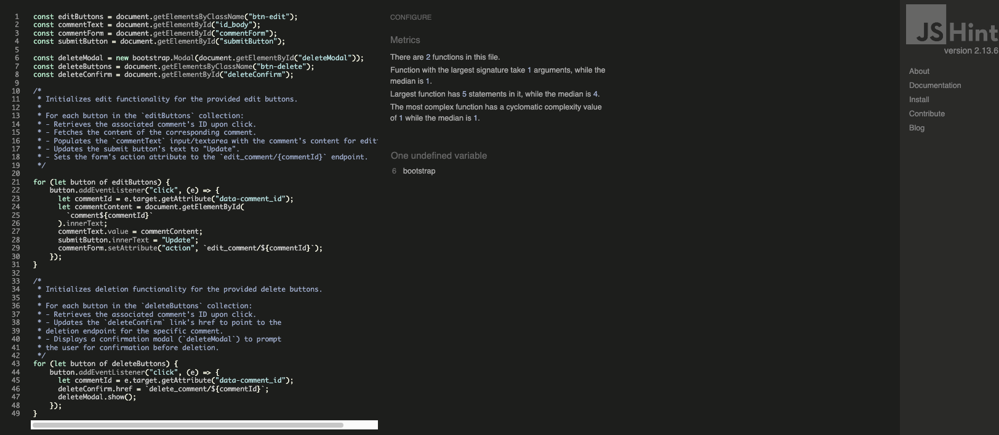
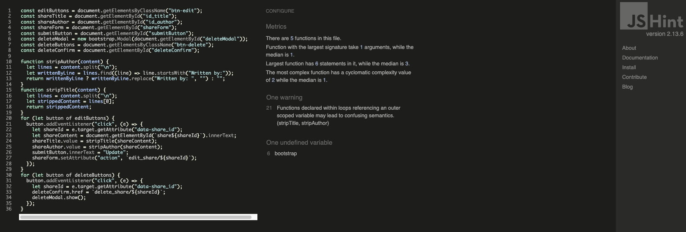
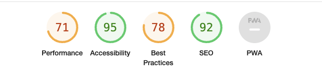
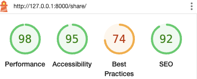
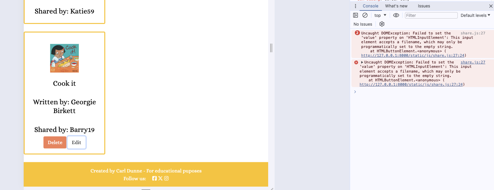
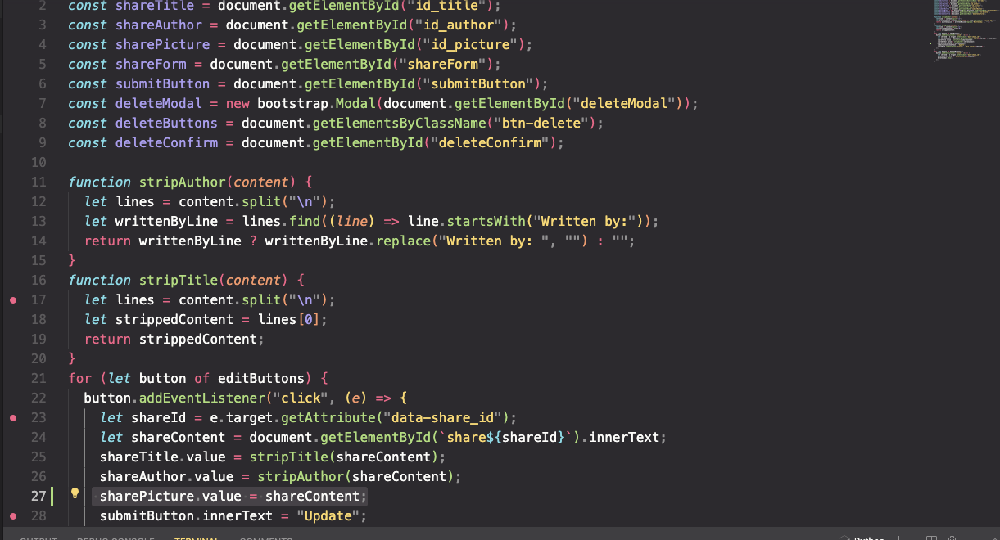
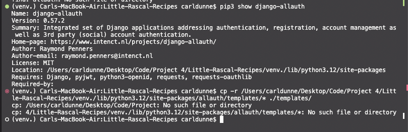
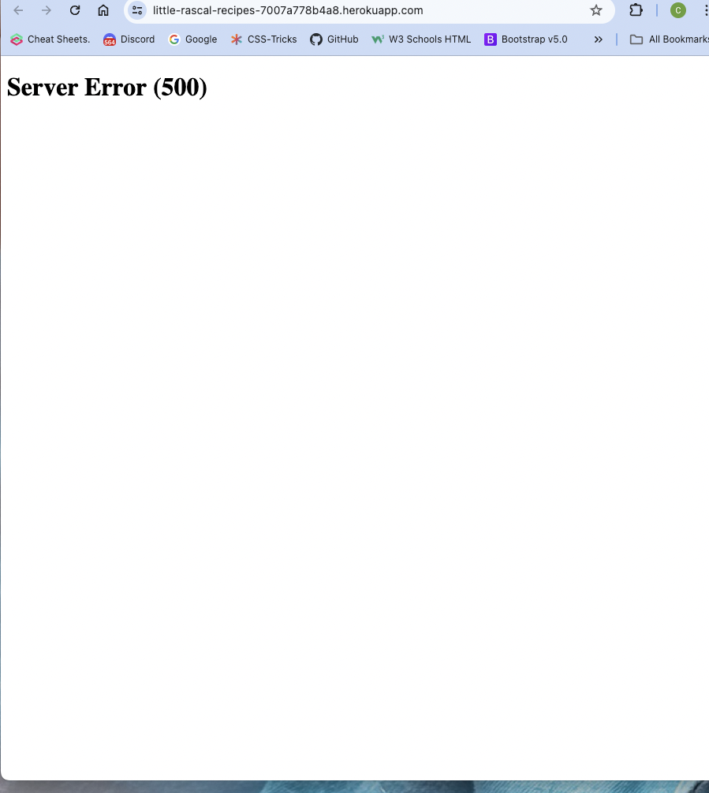

# Testing Little Rascal Recipes Blog

## Contents
- [1. Automated Tests](#automated-tests)
- [2. Manual Tests](#manual-testing)
- [3. Other Bugs and Fixes](#other-bugs-and-fixes)

## Automated Tests

All code was checked by the following validators. Any issues that still remain are documented below their corresponding page.

### Validators:

#### W3C HTML Validator
#### W3C CSS Validator

#### JShint Validator
Comments.js:

 
Share.js:

#### PEP8 Validator

### Lighthouse Results:

#### Home Page:

#### Recipe Details:

#### About page:

#### Contact Page:

#### Share Page:

#### Sign Up Page:

#### Log in Page:

#### Logout Page

## Manual Testing:

Manual testing was carried out throughout the project.

### Registration Tests:
| Test |Result  |
|--|--|
| User can create an account | Pass |
| User can log into a created account| Pass|
|User can log out of created account|Pass|

---

### Navigation Tests:

| Test |Result  |
|--|--|
|User can navigate to all pages accessible| Pass |
|User can view navigation items| Pass|
|User can access posts|Pass|

---

### Logged in Tests:

| Test |Result  |
|--|--|
|Non logged in user cannot access share page| Pass|
|Non superuser cannot access admin panel|Pass|

---

### Commenting Tests

| Test |Result  |
|--|--|
|Logged in user can make a comment when all required fields complete | Pass |
|Logged in user cannot submit post with empty form |Pass|
|Logged in user can edit post while status is awaiting approval |Pass|
|Logged in user can delete post while status is awaiting approval|Pass|
|Edit button is shown on comments created by user|Pass|
|Delete button is shown on comments created by user |Pass|

--- 

### Share Tests

| Test |Result  |
|--|--|
|Logged in user can share a book when all required fields complete | Pass |
|Logged in user cannot submit a book with empty form |Pass|
|Logged in user can edit post while status is awaiting approval |Pass for Title and Author, Fail for Picture (See: [Bug1](#bug-1))|
|Logged in user can delete their shared book while status is awaiting approval|Pass|
|Edit button is shown on shared book created by user|Pass|
|Delete button is shown on shared book created by user |Pass|

--- 

### Admin Tests

| Test |Result  |
|--|--|
|SuperUser can access admin panel|Pass|
|Admin can add items to posts|Pass|
|Admin can add items to comments|Pass|
|Admin can edit items in posts|Pass|
|Admin can edit items in comments|Pass|
|Admin can delete items in posts|Pass|
|Admin can delete items in comments|Pass|
|Admin can edit items in shared books|Pass|
|Admin can delete items in shared books|Pass|

---

### Other Testing
- The site was sent to friends for feedback and testing.
- All forms have validation and will not be submitted without the proper information and fields required filled in.

## Other bugs and Fixes

### Bug 1
One issue whuch unfortunately i was unable to fix was that when a user has shared a book and they try to edit the book they cannot edit all fields. They are able to edit the 'Title' and the 'Author' however the 'Picture' field kept thwing up an error. I spoke wht my colleagues on slack and the tutors however was unable to find an answer and ran out of time to investigate further. So that I could at least get the other fields working I had to delete the lines 4 and 27 in share.js. Please see below:

### Bug 2
I had an issue when implementing the 'location' for django allauth. Thanks to the slack community it was resolved that the terminal could not cope with the space in between 'Project 4' where my project was located. Thi ended up being a simple fix where I just renamed the file and put a 'dash' instead of a space. See below:

### Bug 3
I had another issue that once I had deployed my site to Heroku I was getting a Server Error (500). I checked through my Heroku platform and noticed that I had not added Cloudinary to my Config Vars. Once I did this the issue was resolved.
