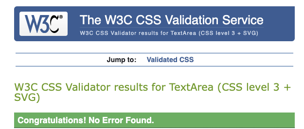
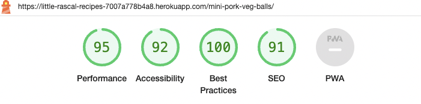
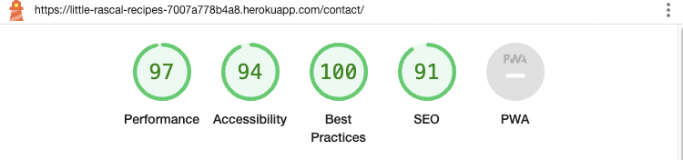
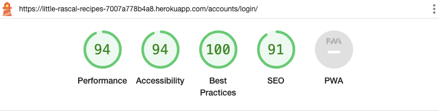
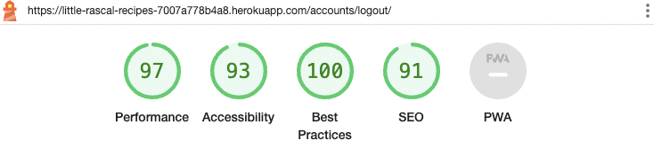

# Testing Little Rascal Recipes Blog

## Contents
- [1. Automated Tests](#automated-tests)
- [2. Manual Tests](#manual-testing)
- [3. Other Bugs and Fixes](#other-bugs-and-fixes)

## Automated Tests

All code was checked by the following validators. Any issues that still remain are documented below their corresponding page.

### Validators:

#### W3C HTML Validator
#### W3C CSS Validator

#### JShint Validator
#### PEP8 Validator

### Lighthouse Results:

#### Home Page:

#### Recipe Details:

#### About page:

#### Contact Page:

#### Share Page:

#### Register Page:

#### Log in Page:

#### Logout Page

## Manual Testing:

Manual testing was carried out throughout the project.

### Registration Tests:
| Test |Result  |
|--|--|
| User can create an account | Pass |
| User can log into a created account| Pass|
|User can log out of created account|Pass|

---

### Navigation Tests:

| Test |Result  |
|--|--|
|User can navigate to all pages accessible| Pass |
|User can view navigation items| Pass|
|User can access posts|Pass|

---

### Logged in Tests:

| Test |Result  |
|--|--|
|Non logged in user cannot access share page| Pass|
|Non superuser cannot access admin panel|Pass|

---

### Commenting Tests

| Test |Result  |
|--|--|
|Logged in user can make a comment when all required fields complete | Pass |
|Logged in user cannot submit post with empty form |Pass|
|Logged in user can edit post while status is awaiting approval |Pass|
|Logged in user can delete post while status is awaiting approval|Pass|
|Edit button is shown on comments created by user|Pass|
|Delete button is shown on comments created by user |Pass|

--- 

### Admin Tests

| Test |Result  |
|--|--|
|SuperUser can access admin panel|Pass|
|Admin can add items to posts|Pass|
|Admin can add items to comments|Pass|
|Admin can edit items in posts|Pass|
|Admin can edit items in comments|Pass|
|Admin can delete items in posts|Pass|
|Admin can delete items in comments|Pass|
|Admin can edit items in shared books|Pass|
|Admin can delete items in shared books|Pass|

---

### Other Testing
- The site was sent to friends for feedback and testing.
- All forms have validation and will not be submitted without the proper information and fields required filled in.

## Other bugs and Fixes